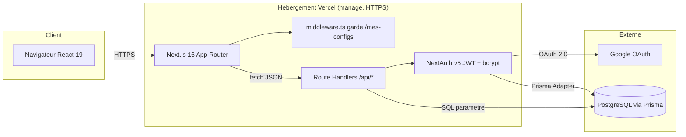

# OhMyBuild

Configurateur de PC gaming : on choisit ses composants, l'app vérifie la
compatibilité en temps réel, estime les FPS par résolution, et permet de
sauvegarder ses configurations dans un compte.

**Démo en ligne :** https://ohmybuild-jegwqdcsa-nichitabelii-2982s-projects.vercel.app
**Compte démo :** `demo@demo.local` / `Demo1234!`

---

## Spécifications fonctionnelles

### Pitch
Monter un PC, c'est se battre contre des incompatibilités (socket CPU/carte mère,
watts d'alim) et deviner les performances réelles. OhMyBuild guide le choix
composant par composant, bloque les combinaisons invalides et chiffre les FPS
attendus avant l'achat.

### Personae cibles
- **Le joueur débutant** : veut un PC qui marche sans rien y connaître, a peur de se tromper de pièce.
- **Le joueur informé** : compare des configs et veut estimer les FPS selon la résolution.
- **Le créateur de builds** : monte plusieurs configs (budget / perf) et veut les sauvegarder.

### MVP — cas d'usage couverts par le code
1. En tant que **visiteur**, je veux partir d'un preset (Budget / Performance) afin de démarrer sans tout choisir. (`components/pc-builder/preset-cards.tsx`)
2. En tant que **visiteur**, je veux choisir chaque composant et voir la compatibilité se vérifier en direct. (`lib/pc-data.ts`, `components/pc-builder/pc-builder.tsx`)
3. En tant que **visiteur**, je veux une estimation FPS par résolution (1080p/1440p/4K). (`components/pc-builder/fps-display.tsx`)
4. En tant qu'**utilisateur**, je veux créer un compte (email/mot de passe **ou Google**) pour sauvegarder mes builds. (`app/(auth)/register`, `auth.ts`)
5. En tant qu'**utilisateur connecté**, je veux sauvegarder, lister, modifier et supprimer mes configs. (`app/api/builds`, `app/mes-configs`)

### Out of scope (volontairement non couvert)
- Achat / paiement réel des composants.
- Stock et prix en temps réel chez les revendeurs.
- Catalogue exhaustif du marché (sous-ensemble curé).
- Partage public d'une config via lien.
- Application mobile native.

### Parcours utilisateur principal
1. Accueil `/` → présentation + CTA. (`app/page.tsx`)
2. Configurateur `/configurateur` → preset ou composant par composant. (`app/configurateur`)
3. Compatibilité + FPS dans la sidebar de résumé. (`components/pc-builder/summary-sidebar.tsx`)
4. Clic « Sauvegarder » → redirection login si non connecté. (`middleware.ts` protège `/mes-configs`)
5. Connexion (credentials ou Google) → config enregistrée.
6. Gestion des configs sur `/mes-configs`. (`app/mes-configs`)

---

## Architecture



### Choix techniques
- **Next.js 16 (App Router)** : un seul framework pour le front (RSC) et l'API (Route Handlers), déploiement Vercel sans serveur à gérer. Inconvénient : couplage fort à Vercel/Next, montées de version parfois cassantes.
- **PostgreSQL + Prisma** : relationnel adapté à User→Build, requêtes typées et paramétrées (anti-SQLi), migrations versionnées. Inconvénient : Postgres managé requis, client Prisma alourdit le cold start.
- **NextAuth v5 (Auth.js)** : sessions JWT, credentials + OAuth Google via Prisma Adapter, peu de code maison sur un domaine sensible. Inconvénient : v5 en beta, docs mouvantes.
- **bcryptjs (cost 12)** : hash standard, pas de binding natif à compiler. Inconvénient : plus lent que des bindings natifs sous forte charge.
- **Zod** : un schéma = validation runtime + type TS inféré, partagé client/serveur. Inconvénient : divergence possible avec le modèle Prisma.
- **Tailwind CSS v4** : design system via `@theme` (tokens XP), pas de CSS mort. Inconvénient : classes verbeuses dans le JSX.

### Limites connues
- Rate-limit **en mémoire** (`lib/rate-limit.ts`) : remis à zéro au cold start, non partagé entre instances.
- Catalogue de composants **statique** dans `lib/pc-data.ts` (pas de back-office).
- Estimation FPS = modèle simplifié (`fps_mult` CPU × FPS GPU), pas un benchmark réel par jeu.
- Pas de tests e2e (uniquement unitaires Vitest).

---

## Lancer en local

```bash
npm install
cp .env.example .env          # puis renseigner les variables ci-dessous
npx prisma migrate deploy     # applique le schéma
npm run db:seed               # crée le compte démo + 2 builds
npm run dev                   # http://localhost:3000
```

### Variables d'environnement

| Variable | Rôle |
| :--- | :--- |
| `DATABASE_URL` | Connexion PostgreSQL |
| `NEXTAUTH_SECRET` (ou `AUTH_SECRET`) | Secret de signature des JWT |
| `NEXTAUTH_URL` | URL de base (ex. `http://localhost:3000`) |
| `GOOGLE_CLIENT_ID` | Client ID OAuth Google |
| `GOOGLE_CLIENT_SECRET` | Client Secret OAuth Google |

> Secrets jamais commités : `.env` / `.env.local` sont dans `.gitignore` et un scan
> **gitleaks** tourne en CI. Voir `.env.example` pour le gabarit.

---

## Structure

```
app/
├── (auth)/{login,register}/   # authentification
├── api/
│   ├── auth/[...nextauth]/     # handlers NextAuth
│   ├── auth/register/          # création compte (bcrypt, rate-limit)
│   ├── builds/                 # CRUD configs (collection)
│   ├── builds/[id]/            # CRUD config unique (ownership vérifié)
│   └── health/                 # healthcheck
├── configurateur/             # le configurateur PC
└── mes-configs/               # configs sauvegardées (protégé)
components/{auth,builds,home,navbar,pc-builder,ui}/
lib/
├── pc-data.ts                 # catalogue + moteur compatibilité/FPS
├── schemas.ts                 # schémas Zod partagés
├── errors.ts                  # hiérarchie d'erreurs + handler HTTP
├── rate-limit.ts              # limiteur en mémoire
├── services/                  # logique métier (build.service)
└── repositories/              # accès données Prisma (build.repository)
prisma/{schema.prisma,seed.ts,migrations/}
```

## Scripts

| Commande | Effet |
| :--- | :--- |
| `npm run dev` / `build` | Dev / build prod |
| `npm run lint` / `typecheck` | ESLint / TypeScript |
| `npm run test` | Tests Vitest |
| `npm run db:migrate` / `db:seed` / `db:studio` | Prisma |

## CI/CD

`.github/workflows/ci.yml` : à chaque push/PR sur `main` et `dev` → lint, typecheck,
tests, build, scan de secrets gitleaks. Déploiement déclenché par Vercel sur push
de la branche de production.
